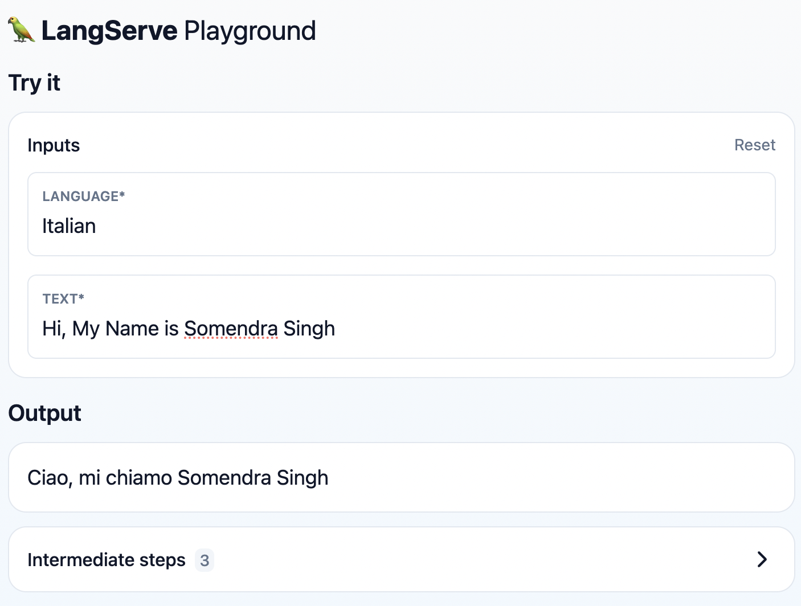
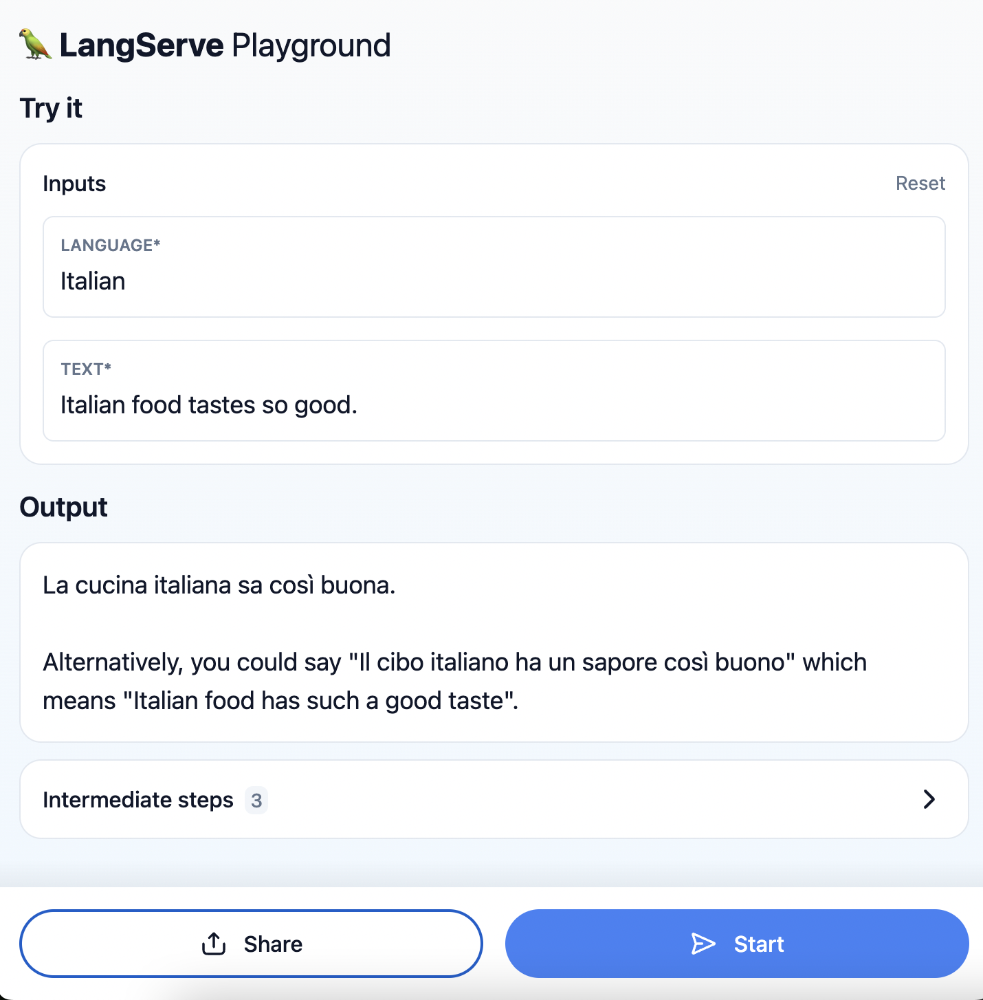

# LangChain Tutorial

Created an end to end application to Translate any thing from any language

## Things i learned:

* Extraction and Set-Up of API key
* Langchain in Jupyter Notebook
* LangSmith
* Using Language Models
* OutputParsers
* Prompt Templates
* Chaining together components with LCEL
* Serving with LangServe
* Server
* Playground

